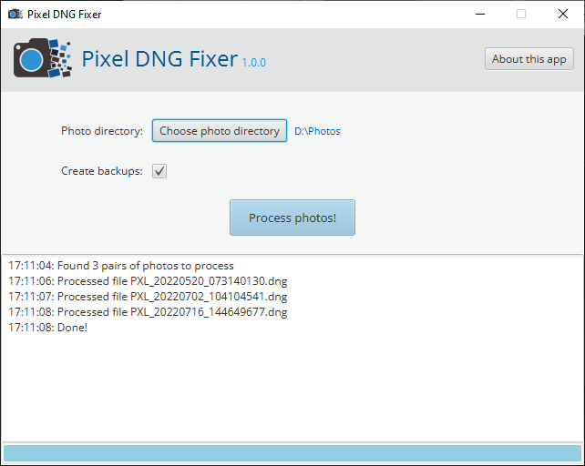

<h1 align="center">


Pixel DNG Fixer
</h1>

> **note**
> An application that fixes broken metadata of DNG (RAW) files generated by the Google Camera app built
> on top of <a href="https://openjfx.io">JavaFX</a>.

<p align="center">


</p>

<p align="center">
  <a href="#how-to-run">How To Run</a> •
  <a href="#metadata">Metadata</a> •
  <a href="#contribute">Contribute</a> •
  <a href="#license">License</a>
</p>

When saving both the JPG and DNG (RAW) photos, the Google Camera application on Pixel smartphones generates DNG
files with missing or invalid metadata (see thereafter for an example). This application uses the JPG files and copy
their metadata to fix the DNG files.

Simply copy the JPG (`sdcard/DCIM/Camera`) and DNG (`sdcard/Pictures/Raw`) files to a single folder. Choose that
directory in the application and hit the big button! That's it.



## How To Run

Make sure [ExifTool](https://exiftool.org) is installed and on the path (`exiftool -ver` to test). You'll also need
the JRE (or JDK) 18 to run the application from sources or the JAR.

Run the application from sources with Maven:
```bash
mvn compile exec:java
```

Or run the fat JAR:
```bash
java -jar pixel-dng-fixer-[version].jar
```

## Metadata

The following metadata are currently supported:

- ISO
- ApertureValue
- ShutterSpeedValue
- MeteringMode
- FNumber
- ExposureTime
- ExposureProgram
- GPSLatitude
- GPSLatitudeRef
- GPSLongitude
- GPSLongitudeRef
- GPSAltitude
- GPSAltitudeRef
- GPSTimeStamp
- SubSecTimeOriginal
- GPSImgDirection
- GPSImgDirectionRef
- OffsetTime

> **warning**
> The depth map metadata are missing from DNG files but not copied yet.

This is an example of photo metadata, as created by the Google Camera app with a Pixel 4a 5G and reported by
[ExifTool](https://exiftool.org).

```
         ExifTool tag   JPG photo                 DNG photo
         ============   =========                 =========
                  ISO   67                        64
             APERTURE   1.72907446261573          1.69999970969816
        SHUTTER_SPEED   0.000128139243606331      0.00012822898256381
        METERING_MODE   2                         null
              FNUMBER   1.73                      1.7
        EXPOSURE_TIME   0.000128                  0.0001282291487
     EXPOSURE_PROGRAM   2                         null
         GPS_LATITUDE   35.5515083333333          null
     GPS_LATITUDE_REF   N                         null
        GPS_LONGITUDE   24.1923444444444          null
    GPS_LONGITUDE_REF   E                         null
         GPS_ALTITUDE   80.91                     null
     GPS_ALTITUDE_REF   0                         null
        GPS_TIMESTAMP   07:31:40                  null
SUB_SEC_TIME_ORIGINAL   129                       164973
    GPS_IMG_DIRECTION   41                        null
GPS_IMG_DIRECTION_REF   M                         null
          OFFSET_TIME   +03:00                    null
        SOFTWARE HDR+   1.0.377695977zd           HDR+ 1.0.377695977zd
                 MAKE   Google                    Google
                MODEL   Pixel 4a (5G)             Pixel 4a (5G)
```

## Contribute

Contributions, [discussions](https://github.com/qligier/PixelDngFixer/discussions)
and [bug reports](https://github.com/qligier/PixelDngFixer/issues) are always welcome!

## License

The application is licensed under the [MIT License](https://opensource.org/licenses/mit-license.php).
See the [LICENSE](LICENSE.txt) for more information.

### How to build

```bash
mvn clean package
```
